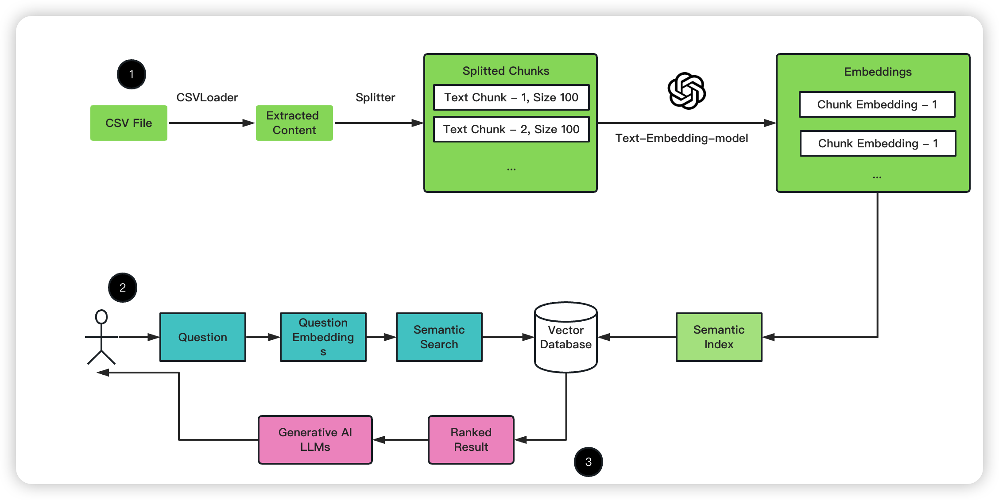

<!--
 * @Date: 2023-05-12 11:06:51
 * @Author: Bruce
 * @Description: 
-->
# 🦜️🔗 LangChain 

## **📖 How to read the PDF file(Here are three methods)**

**1). Using PyPDF2**

```python
from PyPDF2 import PdfReader

pdf_reader = PdfReader("Your file path")

raw_text = ""
for i, v in enumerate(pdf_reader.pages):
    text = v.extract_text()
    if text:
        raw_text += text

print(raw_text[:10])
```

**2). Using PyPDFLoader**

```python
from langchain.document_loaders import PyPDFLoader

loader = PyPDFLoader("Your file Path")

doc = loader.load()

print(doc[0])
```

**3). Using PyMuPDFLoader**

```python
from langchain.document_loaders import PyMuPDFLoader

loader = PyMuPDFLoader("Your file Path")

doc = loader.load()
```

## **🚀 How to choose the PDF method?**

```
PyMuPDFLoader is the fastest of the PDF parsing options, 
And contains detailed metadata about the PDF and its pages, 
As well as returns one document per page
```

## **👀 LangChain + PDF**

```
cd langchain_pdf

python main.py

# You can input the question what you want to know about the careforsow.pdf
# You can change your PDF file to query the questions.
```

## **📖 How to read the CSV file(Here are three steps)**

**1). Using `CSVLoader` to extract the content,split that multiple chunks, and use the OpenAI to store the vectors**

**2). When the user input the question**

**3). Finally, the Vector Database to find the most similairty answer**



## **📖 How to get the info of bilibili**

```python
pip install bilibili-api-python
```

**1). Get the information of bilibili**

```python
import asyncio
from bilibili_api import video

async def main() -> None:
    # Instantiate an object
    v = video.Video(bvid="xxx")
    # Get the detailed information video
    info = await v.get_info()
    # Print the information
    print(info)

if __name__ == '__main__':
    asyncio.get_event_loop().run_until_complete(main())
```

**1). How to like a video**

```python
import asyncio
from decouple import config
from bilibili_api import video, Credential

async def main() -> None:
    # Instantiate the objects
    credential = Credential(
        sessdata=config("SESSDATA"),
        bili_jct=config("BILI_JCT"),
        buvid3=config("BUVID3"),
    )
    v = video.Video(bvid="xxx", credential=credential)
    # like the video
    await v.like(True)

if __name__ == '__main__':
    asyncio.get_event_loop().run_until_complete(main())
```

## **📖 How to get the info of youtube**

**1). Get the information of Youtube**

```python
# pip install youtube-transcript-api
from langchain.document_loaders import YoutubeLoader

loader = YoutubeLoader.from_youtube_url("https://www.youtube.com/watch?v=C_78DM8fG6E")

result = loader.load()
```

**2). Get the information of Youtube**

```python
# pip install pytube
from pytube import YouTube

# the URL of the Youtube video
url = "https://www.youtube.com/watch?v=C_78DM8fG6E"

video = YouTube(url, use_oauth=True, allow_oauth_cache=True)

audio = video.streams.filter(only_audio=True).first()

# Get the title of the Youtube video
video_title = video.streams[0].title

video.streams.get_highest_resolution().filesize

audio = video.streams.get_audio_only()

# Download the video
audio.download(output_path="temp")
```
